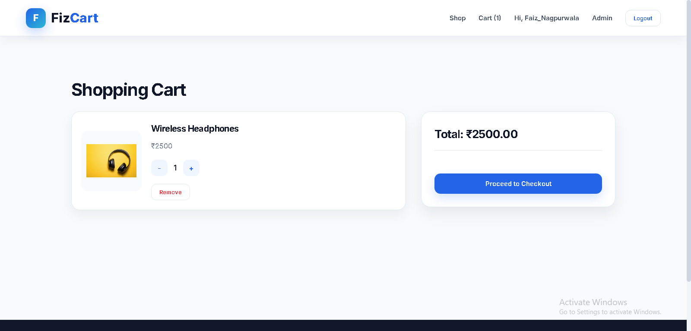
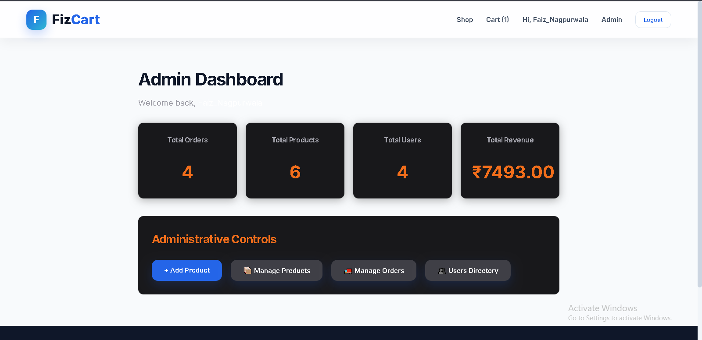

# 🛒 FizCart - MERN Ecommerce Platform

A full-stack MERN e-commerce platform featuring JWT authentication, Razorpay payments, shopping cart, and an admin dashboard.

## 🌐 Live Demo

**🚀 Website:** https://fizcart-mern-ecommerce-1.onrender.com

## 💻 Source Code

https://github.com/faiz123123/FizCart-MERN-Ecommerce

## 🚀 Features

### 👤 User Features

- User Registration & Login (JWT Authentication)
- Secure Password Encryption
- Browse Products by Category
- Product Search
- Shopping Cart
- Wishlist (if implemented)
- Checkout Process
- Razorpay Payment Gateway Integration
- Order History
- User Profile Management

### 🛍️ Product Features

- Product Listing
- Product Details Page
- Product Images
- Stock Availability
- Related Products

### 🔐 Admin Features

- Admin Dashboard
- Add/Edit/Delete Products
- Manage Orders
- Manage Users
- View Sales Data

---

## 🛠️ Tech Stack

### Frontend

- React.js
- React Router
- Redux Toolkit / Context API
- Axios
- CSS / Tailwind CSS / Bootstrap _(Update based on your project)_

### Backend

- Node.js
- Express.js
- MongoDB
- Mongoose

### Authentication

- JWT (JSON Web Token)
- bcrypt

### Payment

- Razorpay Payment Gateway

### Other Tools

- Nodemon
- dotenv
- Git & GitHub

---

## 📂 Project Structure

```
FizCart
│
├── Backend
│   ├── config
│   ├── controller
│   ├── middleware
│   ├── model
│   ├── routes
│   ├── utils
│   ├── package.json
│   └── index.js
│
├── frontend
│   ├── public
│   ├── src
│   └── package.json
│
└── README.md
```

---

## ⚙️ Installation

### Clone Repository

```bash
git clone https://github.com/faiz123123/FizCart-MERN-Ecommerce.git
```

```bash
cd FizCart-MERN-Ecommerce
```

---

### Install Backend

```bash
cd Backend
npm install
```

---

### Install Frontend

```bash
cd ../frontend
npm install
```

---

## � Deployment

This project is configured to be deployed on Render.

- The backend serves the React build in production mode.
- The frontend build should be generated before deployment.
- Make sure the Render service uses the backend entry point and has the required environment variables set.

---

## �🔑 Environment Variables

Create a `.env` file inside the **Backend** folder.

```env
PORT=5000

MONGO_URI=your_mongodb_connection_string

JWT_SECRET=your_jwt_secret

RAZORPAY_KEY_ID=your_key_id

RAZORPAY_KEY_SECRET=your_key_secret

EMAIL_USER=your_email

EMAIL_PASS=your_email_password
```

---

## ▶️ Run Backend

```bash
cd Backend
npm run dev
```

---

## ▶️ Run Frontend

```bash
cd frontend
npm start
```

---

## 💳 Payment Gateway

FizCart integrates **Razorpay** for secure online payments.

Features include:

- Secure Checkout
- Test Mode Payments
- Order Verification
- Payment Confirmation

---

## 📸 Screenshots

### 🏠 Home Page

<p align="center">
  
</p>

---

### 🛒 Shopping Cart

<p align="center">
  
</p>

---

### 👨‍💼 Admin Dashboard

<p align="center">
  
</p>

---

## 📌 Future Improvements

- Product Reviews & Ratings
- Coupons & Discounts
- Email Notifications
- Inventory Management
- Sales Analytics
- Dark Mode
- Wishlist Enhancements

---

## 👨‍💻 Author

**Faiz Nagpurwala**

GitHub:
https://github.com/faiz123123

---

## ⭐ Support

If you like this project, consider giving it a ⭐ on GitHub.

---

## 📄 License

This project is developed for learning and portfolio purposes.
